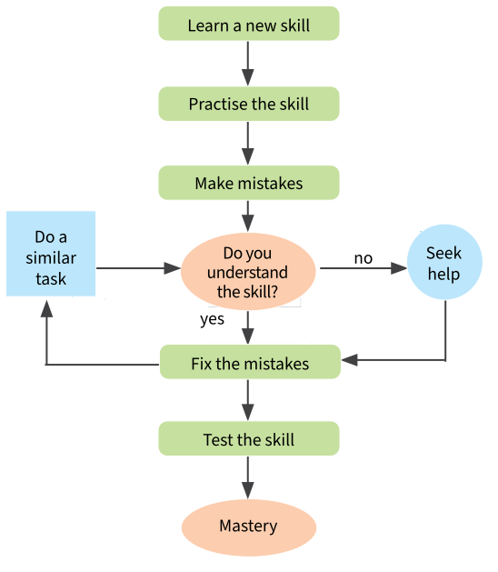
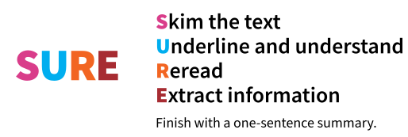
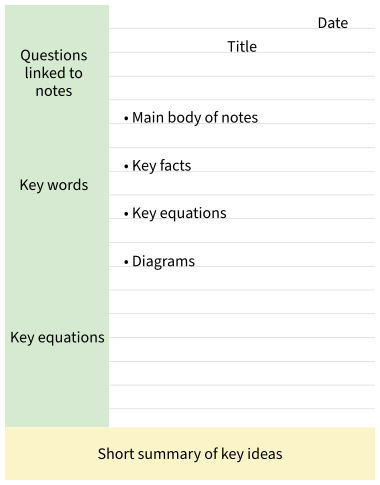
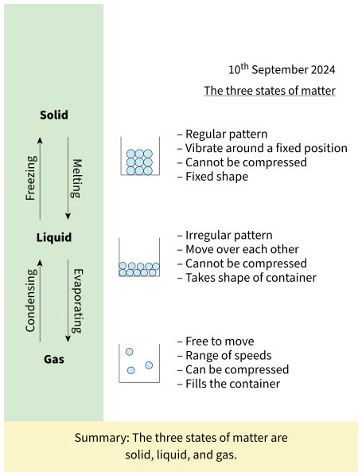

# Being a scientist

---
**Summary**: Often science lessons at secondary school are very different from what you may be used to in primary school. Secondary students need to work more independently – this could be doing an experiment in...
**Tags**: #science #oxford-science #student-book-7
**Created**: 2026-05-19
**Last Updated**: 2026-05-19
---

# Being a scientist

**Often science lessons at secondary school are very different from what you may be used to in primary school. Secondary students need to work more independently – this could be doing an experiment in small groups, or working on your own to understand a new topic. It is important that you have a range of strategies to use when learning new scientific content.**

At secondary school, you often need to approach learning in a much more independent way. It is important that you know what resources are available to help you. This includes reviewing the notes in your book, using online resources like Kerboodle, and knowing when to ask a partner or your teacher for help. Knowing who or what can help you will mean you can work on any task with confidence.

Sometimes when you start to learn a new topic it can feel like you will never remember it all. However, by practising your skills, learning from your mistakes, and seeking help when you need it, you will soon master any new topic. You can use the flowchart in Figure 1 to help you master secondary science.

*Figure 1A flowchart to help you master secondary science.  Full text alternative to the content*

## Reading scientific texts

Reading and understanding scientific texts is a big part of secondary science. It is different from reading a book. Usually there is a lot of information in short paragraphs and there are lots of examples, diagrams, and data for you to understand.

The SURE method is an approach you can use to help you read and understand scientific texts. Each letter in SURE represents a different step in the process. You should follow this process every time.

When extracting information from a text, it is important to keep to key facts. You might just write a list of bullet points that cover the key ideas, including any equations or diagrams. Or you may choose to write notes with more detail. You can also use the Cornell notes method in Figure 2 when taking notes. To help you understand what using this method would look like in a lesson, see Figure 3.

*Figure 2The Cornell notes method. This is a strategy to help you when taking notes.  Full text alternative to the content*

*Figure 3An example of using the Cornell notes method in a lesson on the three states of matter.  Full text alternative to the content*

> **Talk about …**
> Discuss with a partner what resources you can use if:
> - you are stuck with a question in a lesson
> - you are stuck with a question when doing homework
> - you are unsure about what to do during a practical investigation
> - you are unsure if your answer is correct.