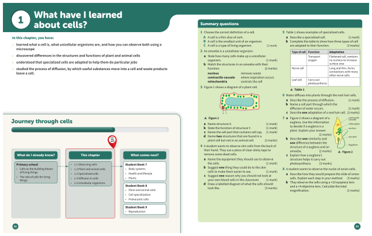

# How to use this book

---
**Summary**: Each topic begins with a set of learning objectives. These tell you what you will be able to do by the end of the lesson.
**Tags**: #science #oxford-science #student-book-7
**Created**: 2026-05-19
**Last Updated**: 2026-05-19
---

# How to use this book

Each topic begins with a set of learning objectives. These tell you what you will be able to do by the end of the lesson.

> **Think back**
> Here you will find some short questions that will remind you what you already know about a topic.

This introduction shows you all the different features *Oxford International Science* has to support you on your journey through Lower Secondary Science.

Being a scientist is great fun. As you work through this Student Book, you will learn how to work as a scientist and get answers to questions that science can answer.

This book is full of activities to help build your confidence and skills in science.
> These boxes contain a short question after each section of text so you can check your understanding of the topic so far.

> **Key idea**
> The key idea summarizes the main points of each topic in a few sentences.

> **Key words**
> The key words for each topic are highlighted in **bold** in the text. They are also included in order of appearance in this box. You can also find them in the Glossary at the back of your Student Book.

> **Working scientifically**
> Scientists work in a particular way to carry out fair and scientific investigations. These boxes contain activities and tips to help you build these skills and understand the process so that you can work scientifically.

> **Maths skills**
> Scientists use maths to help them solve problems and carry out their investigations. These boxes contain activities and tips to help you practise the maths you need for scientific purposes.

> **Literacy skills**
> Scientists need to be able to communicate and share their ideas. These boxes contain activities and tips to help develop your reading, writing, listening, and speaking skills.

> **Stretch zone**
> 1. 1The first question asks you to recall information.
> 2. 3The second question builds on what you have learned.
> > **Stretch zone**
> > 1. The third question moves you into the ‘stretch zone’. This means you will need to think more deeply about scientific concepts. It is OK if you find this question difficult – doing challenging work is the exercise that your brain needs.

> Each unit begins with an introduction. This introduces you to the awe and wonder of science and helps you understand your place in the scientific world.
> It asks some important questions that you will find the answers to in the unit.

> Each chapter begins with an introduction. This reminds you what you already know and shows you what is coming up in the chapter. It also shows you the Working scientifically and Maths skills that you will learn. The chapter map shows how far through the unit you have progressed.

> This shows clearly what science you already know, the new topics you will study in this chapter, and the next steps in your science learning.

> This summarizes what you have learned so far and shows your progress through the unit.

> You can use these exam-style questions to test how well you know the topics in the chapter.

