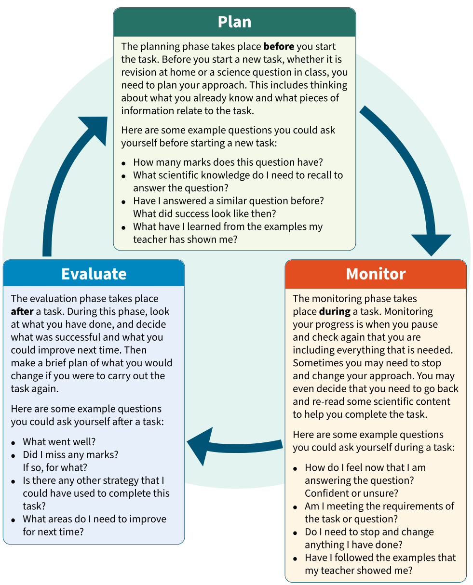

# Plan, monitor, evaluate

---
**Summary**: Expert learners approach new and unfamiliar tasks in a structured way. Often they will start by studying the question or task, thinking carefully about what subject knowledge they are going to need...
**Tags**: #science #oxford-science #student-book-7
**Created**: 2026-05-19
**Last Updated**: 2026-05-19
---

# Plan, monitor, evaluate

**Expert learners approach new and unfamiliar tasks in a structured way. Often they will start by studying the question or task, thinking carefully about what subject knowledge they are going to need or whether they have seen something similar before.**

During a task, an expert learner will keep checking to make sure they are focusing on the right thing by regularly looking back at the question. Sometimes they may even decide to start the task again and choose a different approach. After they have finished, an expert learner will reflect on their work by thinking about any areas of improvement and what they would do differently next time.

The Plan, Monitor, Evaluate cycle is a structure you can follow to help you approach a new task like an expert learner. The cycle should be used every time you complete a task.

> **Talk about …**
> Discuss with a partner your answers to these questions:
> - When does the planning phase take place?
> - How can you monitor your progress during the monitoring phase?
> - Why is the evaluation phase important?

[Full text alternative to the content](workid-53799-front-matter-part-4-sec-9009.xhtml#workid-53799-front-matter-part-4-sec-9009)