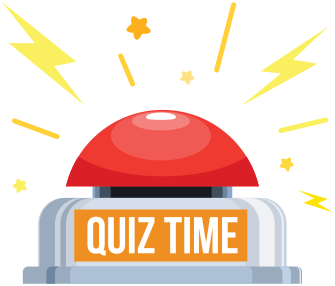

# Which revision strategy?

---
**Summary**: Work through the revision strategies on the next few pages. Choose strategies you can use for each topic and add them to the fourth column of your table.
**Tags**: #science #oxford-science #student-book-7
**Created**: 2026-05-19
**Last Updated**: 2026-05-19
---

Work through the revision strategies on the next few pages. Choose strategies you can use for each topic and add them to the fourth column of your table.

> **Learning tip**
> Stretch your thinking by revising difficult topics by yourself first, and then with the support of your peers and teacher.

### Revision strategies for independent study

When revising a topic, start by noting down all the key information as you read it, including any diagrams or equations. The more you process information (e.g. reading and then writing or drawing, then reading it again), the better you store your learning in your long-term memory. This leads to understanding at a deeper level. You could organize information in:
- a mind map – to show how key information is linked together (see Figure 1)
Figure 1A mind map.  Full text alternative to the content
- a flowchart – to show the main steps in a process (see Figure 2)
Figure 2A flowchart.  Full text alternative to the content
- a Venn diagram – to make comparisons (see Figure 3).
Figure 3A Venn diagram.  Full text alternative to the content

1. Copy important diagrams and tables from the topic you are revising. Make sure that you label all parts accurately and use the correct headings and units.
Figure 4A labelled diagram.  Full text alternative to the content
2. Close your Student Book and hide your diagram/table.
3. Draw the diagram/table again from memory. See how much you can remember!
4. Compare the new diagram/table with the original and see what you have missed, put in the wrong place, or spelled incorrectly.
5. Add the information that you missed or got wrong.
6. Repeat the steps until you can complete the diagram/table correctly.

> **Learning tip**
> Copying is a great way of remembering information.

1. For each topic, write key words on separate cards. Then write a short definition for each word on another set of cards.
Learning tipDefine key vocabulary in your own words. This helps you understand the words better.
2. Put the key word flashcards face down in a pile. Read a definition flashcard, then write down the matching key word on scrap paper. Repeat for all the definitions.
3. Check your work. Note down the key words you need to revise.
4. Then put the definition flashcards face down in a pile. This time, read a key word flashcard and write its definition on scrap paper. Your definition does not need to be word-perfect, as long as it gives the same information.
5. Check your work. Find each word whose definition you got wrong in your Student Book. Study how the word is used in the text.
6. Close the book. Try to define the word again.
7. Repeat the steps until you can confidently define the words.
8. If you still feel unsure about any of the words, ask a peer or your teacher for support.

Make a flashcard for each topic, then test yourself to see how much you can remember from each card. As you go through the chapter, you can mix flashcards from different topics.

> **Learning tip**
> Flashcards are a useful way of summarizing important facts.

Using a voice recorder allows you to listen to your notes using headphones or through speakers whenever you want.
1. Make written notes of the key information in the topic.
2. Find a quiet space.
3. Record yourself reading your notes aloud in a clear voice. Don’t speak too quickly!
4. Save the recording to a safe place on a computer or device.

> **Learning tip**
> After listening to your recording a few times, you will remember the information more easily.

Revision strategies for working in pairs and in a group
1. Find a ‘study buddy’ to work with.
2. Read the relevant pages in your Student Book. Decide on the key information together.
3. Make a large page or a presentation slide on a computer to display the information, including pictures and diagrams. You and your study buddy could work on separate topics.
4. Try to fit all the information into six large pages or slides.
5. After each topic, review each other’s work. Discuss the information you have included. Is the information relevant? Is there any information you do not understand?
6. If there is anything you do not understand, read through the relevant Student Book pages to remind yourself of the information. If you still feel unsure, ask a peer or your teacher for support.
7. Practise your presentation and present it to your peers. Allow them to ask you questions at the end.

> **Learning tip**
> Make your presentation attractive using colour – this makes your revision notes interesting to design and read.

1. Use the Summary questions from your Student Book. Copy the questions on the topic onto small pieces of paper.
2. Write down the answer to each question separately. Check with your teacher that your answers are correct.
3. Shuffle everyone’s papers and place them in a pile face down in the middle of the group.
4. Take turns to pick up a question. Read it aloud to your group, then say or write down the answer.
5. Check your answer with the prepared one. If your answer is incorrect, return the paper to the bottom of the pile. If you get it right, keep the paper. It is now the turn of the next person in your group.

At the end of the quiz, return to the questions you got wrong. Read through the relevant Student Book pages to remind yourself of the information. Try to answer the questions again. Repeat this until you get all the answers right.

1. Copy out key words onto small pieces of paper. Fold them up and place them in a container.
2. Player 1 chooses a key word from the container. The other players must not see the word when Player 1 unfolds it.
3. Player 1 describes the word in the best way they can. If they accidentally say the word, they lose their turn and return the folded paper to the container.
4. If anyone guesses correctly, they keep the word. It is now their turn to describe a key word.
5. The game continues until all the words have been used. The winner is the player with the most guessed words.

At the end of the game, think about the words you found most difficult to describe. Return to the Student Book page where the word is identified as a key word. Revise its meaning. Some words are just difficult to describe, but it could be that you do not fully understand what it means.

> **Learning tip**
> Team quizzes and vocabulary games are fun and effective revision strategies.